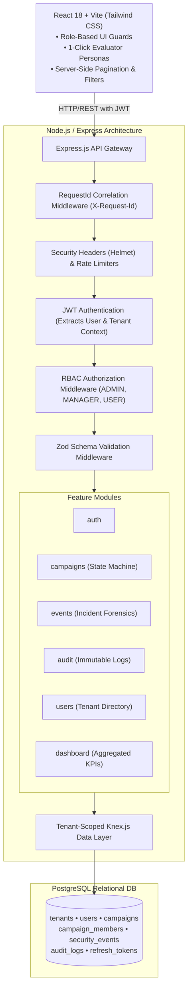

# DeepTrace Cybernetics — Multi-Tenant Security Management Platform

A production-grade, multi-tenant cybersecurity management platform developed for the **Deep Trace Cybernetics Technical Assessment**. Built with **Node.js / Express.js**, **PostgreSQL / Knex.js**, and **React 18 / Vite / Tailwind CSS**.

---

## 📑 Table of Contents
1. [Core Features & Architecture](#core-features--architecture)
2. [Security Model & Multi-Tenant Isolation](#security-model--multi-tenant-isolation)
3. [Quick Start (Docker Compose)](#quick-start-docker-compose)
4. [Manual Local Setup](#manual-local-setup)
5. [Pre-Seeded Accounts & Demo Personas](#pre-seeded-accounts--demo-personas)
6. [Mandatory Security Scenario & Verification](#mandatory-security-scenario--verification)
7. [Automated Test Suite](#automated-test-suite)
8. [Engineering & Architectural Answers](#engineering--architectural-answers)
   - [Q1: Scaling to 1,000 Tenants / 1M Users](#q1-scaling-to-1000-tenants--1m-users)
   - [Q2: JWT Revocation Strategies](#q2-jwt-revocation-strategies)
   - [Q3: Troubleshooting 500 Errors in Production](#q3-troubleshooting-500-errors-in-production)
9. [Recommended 5–10 Minute Demo Video Walkthrough](#recommended-510-minute-demo-video-walkthrough)

---

## 1. Core Features & Architecture



### Highlights:
- **Zero-Trust Multi-Tenancy**: Tenant ID is **never accepted from request parameters or request bodies**. It is derived solely from cryptographically verified JWT tokens.
- **OWASP Anti-Enumeration Pattern**: Cross-tenant requests to private resources return `404 Not Found` rather than `403 Forbidden` to prevent malicious attackers from enumerating valid resource IDs.
- **Campaign State Machine**: Enforces strict lifecycle transitions:
  - `DRAFT` $\rightarrow$ `ACTIVE` or `CANCELLED`
  - `ACTIVE` $\rightarrow$ `COMPLETED` or `CANCELLED`
  - `COMPLETED` and `CANCELLED` are terminal states and cannot transition back.
- **Role-Based Access Control (RBAC)**:
  - **ADMIN**: Full tenant administration, user provisioning, campaign deletion, and immutable audit log inspection.
  - **MANAGER**: Campaign creation/updates, member assignment, and incident status updates.
  - **USER (Analyst)**: Read-only access to tenant metrics, campaigns, and events.
- **Audit Trails**: Every state mutation (logins, updates, transitions, member assignments) is recorded in an immutable audit table capturing actor identity, IP, user-agent, and JSON payload diffs.
- **1-Click Quick Demo Login**: Instant persona switching on the login screen for evaluators.

---

## 2. Security Model & Multi-Tenant Isolation

Multi-tenancy is enforced using a **5-Layer Defense-in-Depth** model:

1. **Cryptographic Identity Layer**: On login, the authenticated user's `tenantId` is embedded directly into the signed JWT access token.
2. **Gateway Middleware Layer (`authenticate.js`)**: Validates JWT signature, checks active account status in the database, and binds `req.user = { id, tenantId, role, ... }`.
3. **RBAC Guard Layer (`authorize.js`)**: Halts unauthorized requests before reaching services (e.g. non-admins attempting to view audit logs or delete campaigns receive `403 Forbidden`).
4. **Service & Repository Query Scoping**: Every Knex query includes explicit `.where('tenant_id', req.user.tenantId)`. Even if a user knows a resource UUID belonging to another organization, the query returns zero rows.
5. **Anti-IDOR Foreign Key Verification**: When assigning users to campaigns, the service verifies that both the campaign and the target user belong to the authenticated user's tenant before committing the association.

---

## 3. Quick Start (Docker Compose)

The fastest way to launch the complete platform (PostgreSQL, Backend API, and Frontend SPA):

```bash
# 1. Clone repository
git clone <your-repo-url>
cd deeptrace-security-platform

# 2. Launch all services (builds images, executes migrations, and populates seed data)
docker-compose up --build
```

- **Frontend Application**: [http://localhost:3000](http://localhost:3000)
- **Backend API**: [http://localhost:5000](http://localhost:5000)
- **Health Check**: [http://localhost:5000/health](http://localhost:5000/health)

---

## 4. Manual Local Setup

### Prerequisites
- Node.js (v18+)
- PostgreSQL (v14+) running locally

### Backend Setup
```bash
cd backend

# Install dependencies
npm install

# Copy environment variables
cp .env.example .env

# Run database migrations
npm run migrate

# Run database seeders (creates Tenant A, Tenant B, test users, campaigns, events)
npm run seed

# Start development server
npm run dev
# Server starts on http://localhost:5000
```

### Frontend Setup
```bash
cd ../frontend

# Install dependencies
npm install

# Copy environment variables
cp .env.example .env

# Start Vite development server
npm run dev
# Client starts on http://localhost:5173
```

---

## 5. Pre-Seeded Accounts & Demo Personas

All seeded accounts use password: **`Password123!`**

| Organization (Tenant) | Persona | Role | Email | Password |
|:---|:---|:---:|:---|:---|
| **Tenant A (CyberShield Corp)** | Sarah Connor | **ADMIN** | `admin@cybershield.io` | `Password123!` |
| **Tenant A (CyberShield Corp)** | John Miller | **MANAGER** | `manager@cybershield.io` | `Password123!` |
| **Tenant A (CyberShield Corp)** | David Webb | **USER** | `analyst@cybershield.io` | `Password123!` |
| **Tenant B (SentinelOps Inc)** | Marcus Vance | **ADMIN** | `admin@sentinelops.io` | `Password123!` |
| **Tenant B (SentinelOps Inc)** | Elena Rostova | **MANAGER** | `manager@sentinelops.io` | `Password123!` |

> 💡 **Tip for Reviewers**: On the login screen, click any of the **Quick Demo Access** buttons on the right to immediately sign in as that persona without typing credentials.

---

## 6. Mandatory Security Scenario & Verification

### The Requirement:
> *"Your implementation must prevent cross-tenant access. For example, if Campaign 201 belongs to Tenant B, a user authenticated under Tenant A must not be able to retrieve or modify Campaign 201. `GET /api/campaigns/201` must not expose Tenant B data to a Tenant A user."*

### How It Is Handled:
1. **Tenant B Campaign ID**: `c2000001-0000-0000-0000-000000000001`
2. When a Tenant A user queries `GET /api/campaigns/c2000001-0000-0000-0000-000000000001`:
   - The query executes: `SELECT * FROM campaigns WHERE id = 'c2000001...' AND tenant_id = 'tenant-a-uuid'`
   - The database returns `0` records.
   - The API responds with:
     ```json
     {
       "success": false,
       "error": {
         "message": "Campaign not found",
         "code": "NOT_FOUND"
       }
     }
     ```
   - **HTTP Status Code: `404 Not Found`**.
   - No data is leaked, and the attacker cannot determine whether the ID exists in another tenant.

---

## 7. Automated Test Suite

We provide a comprehensive automated test suite testing authentication, RBAC, state transitions, and the **Mandatory Security Scenario**:

```bash
cd backend
npm test
```

### Key Tests Included:
- `multitenancy.test.js`:
  - `Tenant A user CANNOT view Tenant B campaign (returns 404 Not Found)`
  - `Tenant A user CANNOT modify Tenant B campaign`
  - `Tenant A user CANNOT delete Tenant B campaign`
  - `Tenant A CANNOT assign a Tenant B user to Tenant A campaign`
  - `Tenant A campaign list query never returns Tenant B campaigns`
- `auth.test.js`: Login credentials check, JWT generation, cookie setting, token verification.
- `campaigns.test.js`: State transition checks (`DRAFT` $\rightarrow$ `ACTIVE` $\rightarrow$ `COMPLETED`; terminal state lock), role permissions (USER cannot create/delete; MANAGER cannot delete; ADMIN can delete).

---

## 8. Engineering & Architectural Answers

### Q1: How would you scale this to 1,000 tenants / 1M users?

1. **Database Partitioning & Multi-Tenant Data Architecture**:
   - **Row-Level Partitioning**: For PostgreSQL, introduce declarative table partitioning on high-volume tables (`security_events`, `audit_logs`) partitioned by `tenant_id` hash or range. This ensures index sizes stay small and queries remain localized to specific partitions.
   - **Separate Schema per High-Tier Tenant**: For Fortune 500 tenants with massive workloads, utilize PostgreSQL schemas (`tenant_acme.campaigns`, `tenant_cybershield.campaigns`) connected via search paths, eliminating cross-tenant query overhead entirely while sharing the same database cluster.
   - **Read-Write Splitting**: Deploy PostgreSQL Primary-Replica topologies using PgBouncer for connection pooling. Route read-heavy dashboard and event queries to read replicas.
2. **Caching Strategy with Redis**:
   - Cache user authorization profiles and tenant metadata in Redis with key structure `tenant:{tenantId}:user:{userId}:perms`.
   - Invalidate cache entries only upon user role updates or deactivations.
3. **Stateless API Clustering & Horizontally Scalable Workers**:
   - Run the Node.js Express backend across auto-scaled container pods (e.g. AWS ECS / Kubernetes) behind an Application Load Balancer. Since JWTs are stateless, any pod can handle any tenant request.
   - Ingestion of high-throughput security events should be decoupled from HTTP endpoints using an asynchronous message broker (Apache Kafka or AWS SQS) with worker consumers batch-inserting events into PostgreSQL.

---

### Q2: How would you handle JWT revocation?

In pure stateless JWT architectures, tokens remain valid until expiration. In an enterprise security system, revocation is mandatory for scenarios like password changes, privilege de-escalations, employee termination, or compromised tokens.

1. **Short-Lived Access Tokens + Refresh Token Rotation (Implemented)**:
   - Access tokens have an expiration of only **15 minutes**.
   - Refresh tokens are stored in the database/Redis with single-use rotation. If a user logs out, their refresh token is immediately revoked from the database, preventing any future access token generations.
2. **Redis Token Blocklist with TTL**:
   - When an admin explicitly revokes an active session before the 15-minute access token expires, the token's unique ID (`jti`) is stored in a Redis Blocklist with a TTL equal to the token's remaining lifespan.
   - The `authenticate` middleware checks Redis (`EXISTS blacklist:jti`). If present, the request is denied with `401 Unauthorized`.
   - Because entries expire automatically via TTL, memory usage remains minimal.
3. **Token Versioning / Epoch Column (Global Tenant/User Invalidation)**:
   - Add a `token_version` (integer) or `tokens_valid_after` (timestamp) column to the `users` table and include it in the JWT payload.
   - If a user changes their password or an administrator forces a global logout, increment `token_version` in the database. Any incoming token with an older version is immediately rejected.

---

### Q3: How would you troubleshoot a production API returning many 500 errors?

1. **Triaging with Correlation IDs (`X-Request-Id`)**:
   - Our system attaches a unique UUID `X-Request-Id` to every request and logs it with structured metadata (tenant ID, route, user ID).
   - In production log aggregators (e.g. Datadog, Elasticsearch / Kibana, CloudWatch), filter logs by `status >= 500` and trace the specific `requestId` to inspect the exact unhandled stack trace.
2. **Diagnosing Root Cause Categories**:
   - **Database Connection Pool Exhaustion**: Inspect PostgreSQL active connections (`pg_stat_activity`). A surge in 500s often occurs when pool connections are maxed out due to long-running unindexed queries holding connections open.
   - **External Service / Dependency Outages**: Check APM service maps to determine if third-party APIs (identity providers, notification webhooks) are timing out.
   - **Unhandled Runtime Exceptions**: Review application logs for syntax errors, unhandled promise rejections, or unexpected `null` dereferences following a recent code deployment.
3. **Mitigation & Recovery Playbook**:
   - **Immediate Rollback**: If 500 errors correlate with a recent release, initiate an immediate automated rollback to the previous stable container image via CI/CD.
   - **Circuit Breaking & Rate Throttling**: Temporarily throttle non-critical background jobs to release database connection pressure.
   - **Post-Mortem & Fix**: Reproduce the failing scenario locally using the logged request payload and add a regression test to the test suite before redeploying.

---

## 9. Recommended 5–10 Minute Demo Video Walkthrough

When recording your demo video, follow this structured outline to impress the evaluation team:

1. **Introduction (1 min)**:
   - Introduce yourself and state the project goal: A multi-tenant security management platform built with Node.js, PostgreSQL (Knex), and React/Vite.
   - Point out the tech stack and clean repository structure.
2. **Authentication & Evaluator Persona Switcher (1.5 min)**:
   - Show the Login screen.
   - Highlight the **Quick Demo Access** buttons (demonstrating you built this with the reviewer's convenience in mind).
   - Click *Tenant A — Admin* to log in.
3. **Dashboard & Tenant Metrics (1 min)**:
   - Walk through the metrics cards: Active campaigns, critical open events, tenant user count.
   - Show the Event Severity breakdown and live recent audit activity feed.
4. **Campaign Management & State Machine (2 min)**:
   - Go to *Campaigns*. Show server-side search and status filters.
   - Create a new campaign (starts in `DRAFT`).
   - Open campaign details: show the status progression buttons (`DRAFT` $\rightarrow$ `ACTIVE` $\rightarrow$ `COMPLETED`).
   - Point out that terminal states cannot transition back.
   - Assign a team member to the campaign and remove them.
5. **Security Events & Incident Handling (1 min)**:
   - Go to *Security Events*. Show severity badges (CRITICAL, HIGH, MEDIUM, LOW).
   - Open an incident, change its status from `OPEN` to `INVESTIGATING` with an analyst note.
6. **Mandatory Security Scenario: Multi-Tenant Isolation (1.5 min)**:
   - Note the ID of a Campaign belonging to Tenant A (CyberShield).
   - Log out and log in as *Tenant B — Admin (SentinelOps)*.
   - Demonstrate that Tenant B's campaign list contains ONLY SentinelOps data.
   - (Optional) Open browser DevTools or show via automated test that requesting Tenant A's campaign ID returns `404 Not Found`.
7. **RBAC & Audit Trail (1 min)**:
   - Show *Users & Roles* directory.
   - Show *Audit Logs* (demonstrating every action logged, and explaining it is hidden from USER/MANAGER roles).
8. **Conclusion (30 sec)**:
   - Mention the automated tests, Docker setup, and architectural documentation in the README.
