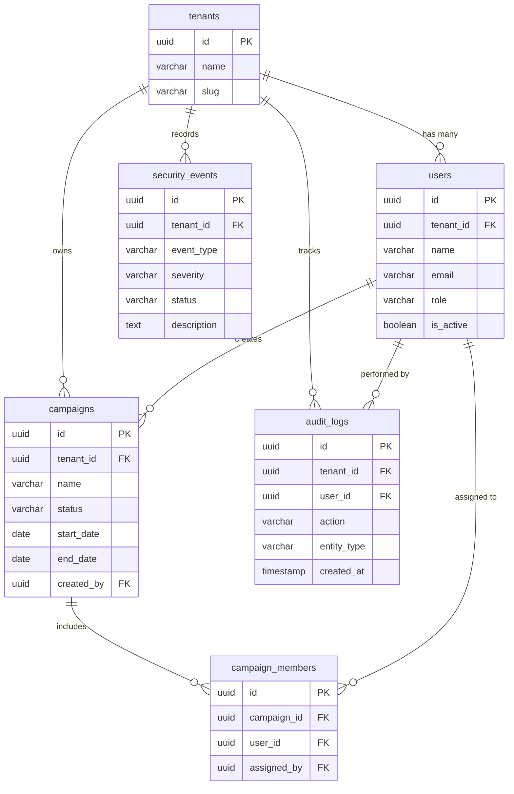

# DeepTrace SQL Hands-On Mastery Guide 🚀
> Learn SQL from scratch directly on the real **DeepTrace** database and codebase.

Welcome! If you are new to SQL, this guide is designed specifically for you. Instead of memorizing abstract textbook examples about fruits or employees, you will learn SQL using **real cybersecurity data**: tenants, security alerts, phishing campaigns, audit trails, and user roles.

---

## 📑 Table of Contents
1. [What is SQL and Why Does DeepTrace Use It?](#1-what-is-sql-and-why-does-deeptrace-use-it)
2. [DeepTrace Database Architecture (The ER Map)](#2-deeptrace-database-architecture-the-er-map)
3. [Your Hands-On Practice Environment](#3-your-hands-on-practice-environment)
4. [Level 1: The Basics — SELECT & FROM](#level-1-the-basics--select--from)
5. [Level 2: Filtering Data — The WHERE Clause](#level-2-filtering-data--the-where-clause)
6. [Level 3: Ordering & Pagination — ORDER BY, LIMIT, OFFSET](#level-3-ordering--pagination--order-by-limit-offset)
7. [Level 4: Aggregation & Metrics — COUNT, GROUP BY, HAVING](#level-4-aggregation--metrics--count-group-by-having)
8. [Level 5: Relational Superpower — Combining Tables with JOIN](#level-5-relational-superpower--combining-tables-with-join)
9. [Level 6: Modifying Data — INSERT, UPDATE, DELETE](#level-6-modifying-data--insert-update-delete)
10. [Level 7: Connecting SQL to DeepTrace Code (Knex.js)](#level-7-connecting-sql-to-deeptrace-code-knexjs)
11. [Level 8: 10 Progressive Hands-On Challenges](#level-8-10-progressive-hands-on-challenges)

---

## 1. What is SQL and Why Does DeepTrace Use It?

**SQL** stands for **Structured Query Language**. It is the universal language used to store, query, update, and manage data in relational databases like **PostgreSQL**.

In DeepTrace:
- When a user logs in, the backend runs a SQL query: *"Find the user with this email."*
- When the Security Dashboard renders, it runs SQL queries: *"Count how many open CRITICAL security alerts exist."*
- When a manager assigns an analyst to a campaign, SQL records that relationship in a junction table.

SQL statements read like English sentences:
```sql
SELECT name, role FROM users WHERE is_active = true;
```
*(Translation: "Show me the name and role from the users table where the user is active.")*

---

## 2. DeepTrace Database Architecture (The ER Map)

DeepTrace has **6 core application tables** structured in a relational hierarchy:



### The Concept of Multi-Tenancy:
Notice that almost every table has a `tenant_id` column. DeepTrace is a **multi-tenant** platform. Company A (`CyberShield Corp`) and Company B (`SentinelOps Inc`) share the same database, but **tenant isolation** guarantees that Company A never sees Company B's data!

---

## 3. Your Hands-On Practice Environment

We have built a dedicated **interactive SQL CLI playground** directly into DeepTrace.

Open your terminal in `deeptrace-security-platform/backend`:

### Option A: Run a Quick Query Directly
```bash
npm run sql -- "SELECT name, role FROM users"
```

### Option B: Open the Interactive REPL
```bash
npm run sql
```
Inside the interactive playground, you can type any query or special command:
- `.tables` — List all tables and current row counts
- `.schema users` — Show table columns and data types
- `.challenges` — List hands-on practice challenges
- `.hint <number>` — Get a hint for a challenge
- `.solve <number>` — View the reference answer
- `exit` — Exit back to your terminal

### Resetting Data Anytime:
If you insert or delete rows while practicing and want to restore the clean initial state:
```bash
npm run seed
```

---

## Level 1: The Basics — SELECT & FROM

Every SQL read query starts with `SELECT` (what columns you want) and `FROM` (which table to look in).

### Syntax:
```sql
SELECT column1, column2 FROM table_name;
```

### 1.1 Select All Columns (`*`):
```sql
SELECT * FROM tenants;
```
*Note: `*` means "give me every single column". In production code, it is best practice to select specific columns.*

### 1.2 Select Specific Columns:
```sql
SELECT id, name, slug FROM tenants;
```

### 1.3 Renaming Columns with Aliases (`AS`):
You can rename columns in your output to make them clearer:
```sql
SELECT name AS organization_name, slug AS url_identifier FROM tenants;
```

👉 **Try it now in terminal:**
```bash
npm run sql -- "SELECT name AS organization_name, slug FROM tenants"
```

---

## Level 2: Filtering Data — The WHERE Clause

Without filtering, you get every row in the table. The `WHERE` clause filters rows based on conditions.

### 2.1 Exact Comparison (`=`):
```sql
SELECT name, email, role FROM users WHERE role = 'ADMIN';
```

### 2.2 Numeric & Boolean Comparisons:
```sql
SELECT name, email FROM users WHERE is_active = true;
```

### 2.3 Multi-Tenant Isolation (The Most Critical Filter in DeepTrace):
To view campaigns only belonging to tenant `a1b2c3d4-e5f6-7890-abcd-ef1234567890`:
```sql
SELECT name, status FROM campaigns WHERE tenant_id = 'a1b2c3d4-e5f6-7890-abcd-ef1234567890';
```

### 2.4 Combining Conditions (`AND`, `OR`, `NOT`):
```sql
-- Find high or critical security alerts
SELECT event_type, severity, status 
FROM security_events 
WHERE severity = 'CRITICAL' OR severity = 'HIGH';

-- Find open critical alerts
SELECT event_type, severity, status 
FROM security_events 
WHERE severity = 'CRITICAL' AND status = 'OPEN';
```

### 2.5 Pattern Matching (`LIKE` and `ILIKE`):
In PostgreSQL:
- `LIKE` is case-sensitive.
- `ILIKE` is case-insensitive.
- `%` is a wildcard matching any characters.

```sql
-- Find any event containing the word 'login' or 'access'
SELECT event_type, description 
FROM security_events 
WHERE description ILIKE '%access%';
```

### 2.6 The `IN` Operator:
Instead of writing multiple `OR` statements:
```sql
SELECT name, status 
FROM campaigns 
WHERE status IN ('ACTIVE', 'DRAFT');
```

### 2.7 Handling Missing Values (`IS NULL` / `IS NOT NULL`):
In SQL, you never say `= NULL`. You must use `IS NULL`:
```sql
-- Find audit logs triggered by the automated system (where user_id is null)
SELECT action, entity_type, created_at 
FROM audit_logs 
WHERE user_id IS NULL;
```

👉 **Try it now in terminal:**
```bash
npm run sql -- "SELECT event_type, severity, status FROM security_events WHERE severity = 'CRITICAL'"
```

---

## Level 3: Ordering & Pagination — ORDER BY, LIMIT, OFFSET

When building dashboards, you need ordered and paginated data (e.g., "Page 1 of 10 items").

### 3.1 Sorting (`ORDER BY`):
- `ASC` (default): Ascending (A-Z, oldest first, lowest first)
- `DESC`: Descending (Z-A, newest first, highest first)

```sql
-- View latest audit events first
SELECT action, created_at 
FROM audit_logs 
ORDER BY created_at DESC;
```

### 3.2 Limiting Rows (`LIMIT`):
```sql
-- Top 3 most recent security events
SELECT event_type, severity, created_at 
FROM security_events 
ORDER BY created_at DESC 
LIMIT 3;
```

### 3.3 Pagination with `OFFSET`:
If page size is 5:
- **Page 1**: `LIMIT 5 OFFSET 0` (rows 1-5)
- **Page 2**: `LIMIT 5 OFFSET 5` (rows 6-10)
- **Page 3**: `LIMIT 5 OFFSET 10` (rows 11-15)

Formula: `OFFSET (page - 1) * limit`

```sql
SELECT id, action, created_at 
FROM audit_logs 
ORDER BY created_at DESC 
LIMIT 5 OFFSET 5;
```

👉 **Try it now in terminal:**
```bash
npm run sql -- "SELECT action, created_at FROM audit_logs ORDER BY created_at DESC LIMIT 5"
```

---

## Level 4: Aggregation & Metrics — COUNT, GROUP BY, HAVING

DeepTrace's Executive Security Dashboard relies heavily on **aggregate queries** to display summary statistics.

### 4.1 Counting Total Rows (`COUNT`):
```sql
SELECT count(*) AS total_users FROM users WHERE is_active = true;
```

### 4.2 Grouping Data (`GROUP BY`):
`GROUP BY` groups identical values together so you can calculate totals for each category.

```sql
-- How many security events exist for each severity level?
SELECT severity, count(*) AS alert_count 
FROM security_events 
GROUP BY severity 
ORDER BY alert_count DESC;
```
Result:
| severity | alert_count |
| :--- | :--- |
| CRITICAL | 2 |
| HIGH | 2 |
| MEDIUM | 1 |
| LOW | 1 |

```sql
-- How many campaigns are in each status?
SELECT status, count(*) AS total_campaigns 
FROM campaigns 
GROUP BY status;
```

### 4.3 Filtering Aggregated Groups (`HAVING`):
- `WHERE` filters individual rows **before** grouping.
- `HAVING` filters groups **after** aggregation.

```sql
-- Only show statuses that have more than 1 campaign
SELECT status, count(*) AS total 
FROM campaigns 
GROUP BY status 
HAVING count(*) > 1;
```

👉 **Try it now in terminal:**
```bash
npm run sql -- "SELECT severity, count(*) AS total FROM security_events GROUP BY severity"
```

---

## Level 5: Relational Superpower — Combining Tables with JOIN

Data is normalized into separate tables to prevent redundancy. We use `JOIN` to reconnect related tables using **Foreign Keys**.

### 5.1 The `INNER JOIN` (Intersection):
Returns records that have matching values in both tables.

```sql
-- Show each user's name along with their organization/tenant name
SELECT users.name AS user_name, users.email, tenants.name AS company_name 
FROM users 
JOIN tenants ON users.tenant_id = tenants.id;
```

### 5.2 The `LEFT JOIN` (Keep everything from left table):
Returns all records from the left table, and matched records from the right table. If there is no match, the right side returns `NULL`.

```sql
-- Show all audit logs with the actor name (even if the user was deleted or action was system-generated)
SELECT 
    audit_logs.action, 
    audit_logs.entity_type, 
    COALESCE(users.name, 'System') AS performed_by, 
    audit_logs.created_at 
FROM audit_logs 
LEFT JOIN users ON audit_logs.user_id = users.id 
ORDER BY audit_logs.created_at DESC 
LIMIT 5;
```

### 5.3 Junction Tables (Many-to-Many Relationships):
A Campaign can have many Users, and a User can be in many Campaigns. This is achieved via `campaign_members`:

```
campaigns (id) <--- (campaign_id) campaign_members (user_id) ---> (id) users
```

To see which users are assigned to which campaigns:
```sql
SELECT 
    campaigns.name AS campaign_title, 
    users.name AS assigned_specialist, 
    users.role 
FROM campaigns 
JOIN campaign_members ON campaigns.id = campaign_members.campaign_id 
JOIN users ON campaign_members.user_id = users.id 
ORDER BY campaigns.name;
```

👉 **Try it now in terminal:**
```bash
npm run sql -- "SELECT c.name AS campaign, u.name AS member FROM campaigns c JOIN campaign_members cm ON c.id = cm.campaign_id JOIN users u ON cm.user_id = u.id"
```

---

## Level 6: Modifying Data — INSERT, UPDATE, DELETE

### 6.1 Creating Data (`INSERT INTO`):
```sql
INSERT INTO security_events (
    tenant_id, 
    event_type, 
    severity, 
    status, 
    description, 
    source
) VALUES (
    'a1b2c3d4-e5f6-7890-abcd-ef1234567890',
    'SQL_INJECTION_ATTEMPT',
    'CRITICAL',
    'OPEN',
    'Detected SQL syntax in query parameters on public endpoint',
    'Web Application Firewall'
);
```

### 6.2 Updating Data (`UPDATE ... SET ... WHERE`):
> ⚠️ **CAUTION**: Always include a `WHERE` clause when updating, or every row in the entire table will be modified!

```sql
-- Promote an analyst to manager
UPDATE users 
SET role = 'MANAGER' 
WHERE email = 'analyst@cybershield.io';

-- Resolve an open security event
UPDATE security_events 
SET status = 'RESOLVED', updated_at = NOW() 
WHERE event_type = 'SQL_INJECTION_ATTEMPT';
```

### 6.3 Deleting Data (`DELETE FROM ... WHERE`):
```sql
DELETE FROM security_events 
WHERE event_type = 'SQL_INJECTION_ATTEMPT';
```

*(Remember: If you make changes and want to reset back to original seed data, just run `npm run seed`!)*

---

## Level 7: Connecting SQL to DeepTrace Code (Knex.js)

Now, look at how the backend code in `src/modules/` executes these queries!

DeepTrace uses **Knex.js**, a SQL query builder for Node.js. It allows developers to construct SQL queries using JavaScript functions while preventing SQL injection vulnerabilities.

### Side-by-Side Comparison:

#### 1. Listing Campaigns with Filters:
- **Raw SQL:**
  ```sql
  SELECT campaigns.*, users.name AS creator_name 
  FROM campaigns 
  LEFT JOIN users ON campaigns.created_by = users.id 
  WHERE campaigns.tenant_id = '...' AND campaigns.status = 'ACTIVE' 
  ORDER BY campaigns.created_at DESC;
  ```
- **DeepTrace Code (`backend/src/modules/campaigns/campaign.service.js`):**
  ```javascript
  const baseQuery = db('campaigns')
    .leftJoin('users', 'campaigns.created_by', 'users.id')
    .where('campaigns.tenant_id', tenantId)
    .select('campaigns.*', 'users.name as creator_name');

  if (status) {
    baseQuery.andWhere('campaigns.status', status);
  }

  baseQuery.orderBy('campaigns.created_at', 'desc');
  ```

#### 2. Dashboard KPIs:
- **Raw SQL:**
  ```sql
  SELECT severity, count(*) AS count 
  FROM security_events 
  WHERE tenant_id = '...' 
  GROUP BY severity;
  ```
- **DeepTrace Code (`backend/src/modules/dashboard/dashboard.service.js`):**
  ```javascript
  const eventSeverityCounts = await db('security_events')
    .where({ tenant_id: tenantId })
    .groupBy('severity')
    .select('severity', db.raw('count(*) as count'));
  ```

When you understand the raw SQL, reading backend database code becomes second nature!

---

## Level 8: 10 Progressive Hands-On Challenges

Practice writing queries in terminal using `npm run sql` or `npm run sql -- "<YOUR_QUERY>"`.

---

### Challenge 1: Tenant Discovery (Warmup)
- **Goal:** Display the `name` and `slug` of all tenants.
<details>
<summary>🔍 Click to view Solution</summary>

```sql
SELECT name, slug FROM tenants;
```
</details>

---

### Challenge 2: Security User Directory
- **Goal:** List the `name`, `email`, and `role` of all users, sorted alphabetically by name.
<details>
<summary>🔍 Click to view Solution</summary>

```sql
SELECT name, email, role FROM users ORDER BY name ASC;
```
</details>

---

### Challenge 3: Active Campaigns Filter
- **Goal:** Find the `name`, `start_date`, and `end_date` for all campaigns that currently have status `'ACTIVE'`.
<details>
<summary>🔍 Click to view Solution</summary>

```sql
SELECT name, start_date, end_date FROM campaigns WHERE status = 'ACTIVE';
```
</details>

---

### Challenge 4: Critical Open Threat Detection
- **Goal:** Retrieve all security events that have severity `'CRITICAL'` and status `'OPEN'`. Display `event_type`, `source`, and `description`.
<details>
<summary>🔍 Click to view Solution</summary>

```sql
SELECT event_type, source, description 
FROM security_events 
WHERE severity = 'CRITICAL' AND status = 'OPEN';
```
</details>

---

### Challenge 5: Severity KPI Breakdown (Analytics)
- **Goal:** Count how many security events exist for each `severity` level, ordered from most frequent to least frequent.
<details>
<summary>🔍 Click to view Solution</summary>

```sql
SELECT severity, count(*) AS event_count 
FROM security_events 
GROUP BY severity 
ORDER BY event_count DESC;
```
</details>

---

### Challenge 6: Campaign Ownership (Join)
- **Goal:** Join `campaigns` and `users` to display the campaign `name`, its `status`, and the `name` of the user who created it (`creator_name`).
<details>
<summary>🔍 Click to view Solution</summary>

```sql
SELECT 
    c.name AS campaign_name, 
    c.status, 
    u.name AS creator_name 
FROM campaigns c 
LEFT JOIN users u ON c.created_by = u.id;
```
</details>

---

### Challenge 7: Assigned Campaign Team (Many-to-Many Join)
- **Goal:** Show which users are assigned to the campaign titled `'Q4 Phishing Resilience Drill'`.
<details>
<summary>🔍 Click to view Solution</summary>

```sql
SELECT 
    c.name AS campaign_name, 
    u.name AS member_name, 
    u.email AS member_email 
FROM campaigns c 
JOIN campaign_members cm ON c.id = cm.campaign_id 
JOIN users u ON cm.user_id = u.id 
WHERE c.name = 'Q4 Phishing Resilience Drill';
```
</details>

---

### Challenge 8: Forensic Audit Log Inspection
- **Goal:** Fetch the 5 most recent audit logs. For each log, show the `action`, `entity_type`, actor `name` (use `'System'` if user is null), and `created_at`.
<details>
<summary>🔍 Click to view Solution</summary>

```sql
SELECT 
    a.action, 
    a.entity_type, 
    COALESCE(u.name, 'System') AS actor_name, 
    a.created_at 
FROM audit_logs a 
LEFT JOIN users u ON a.user_id = u.id 
ORDER BY a.created_at DESC 
LIMIT 5;
```
</details>

---

### Challenge 9: JSON Data Querying (PostgreSQL Feature)
- **Goal:** The `security_events` table contains a JSON column called `metadata`. Retrieve the `event_type` and the target IP address extracted from `metadata->>'ip'` where `metadata->>'ip'` is not null.
<details>
<summary>🔍 Click to view Solution</summary>

```sql
SELECT 
    event_type, 
    metadata->>'ip' AS attacker_ip, 
    description 
FROM security_events 
WHERE metadata->>'ip' IS NOT NULL;
```
</details>

---

### Challenge 10: Multi-Tenant Executive Threat Report
- **Goal:** Produce a comprehensive tenant summary showing:
  - Tenant name
  - Total users in tenant
  - Total campaigns in tenant
  - Total security events in tenant
<details>
<summary>🔍 Click to view Solution</summary>

```sql
SELECT 
    t.name AS tenant_name,
    (SELECT count(*) FROM users u WHERE u.tenant_id = t.id) AS total_users,
    (SELECT count(*) FROM campaigns c WHERE c.tenant_id = t.id) AS total_campaigns,
    (SELECT count(*) FROM security_events e WHERE e.tenant_id = t.id) AS total_events
FROM tenants t;
```
</details>

---

## 🎯 Next Steps: How to Practice
1. Open terminal:
   ```bash
   cd d:\Programming\TEMP\deeptrace-security-platform\backend
   ```
2. Launch the interactive playground:
   ```bash
   npm run sql
   ```
3. Type:
   ```text
   .tables
   ```
   and start querying!
4. Whenever you need to reset the data back to its original state, run:
   ```bash
   npm run seed
   ```
